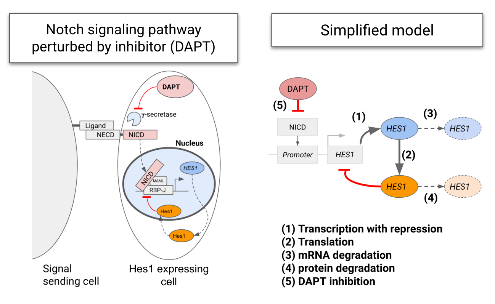
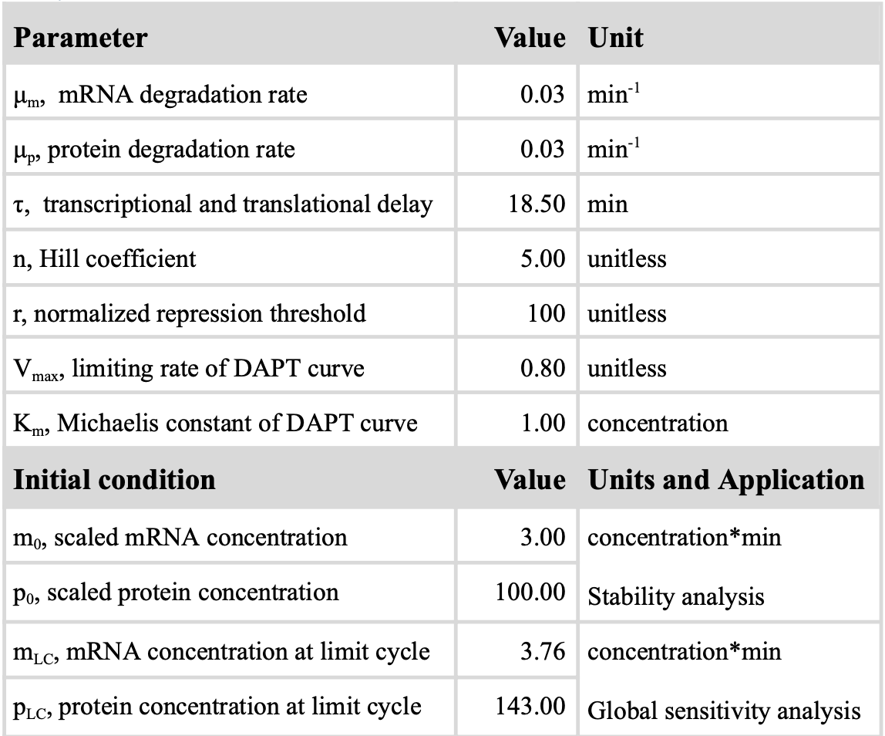

## Modeling of perturbed Notch signaling using Julia 
Last update: 2023-06-28

> "Quantitative descriptions of Notch signaling in small intestinal organoids in DAPT-inhibited and recovery states" (Chia et al, 2023)

This public repository showcases the mathematical modeling work described in the above-mentioned thesis report.

### Overview
Notch signaling activates oscillating expression of the Hes1 gene, and can be inhibited by a class of drug molecule named Gamma-secretase inhibitor (GSI). Hes1 oscillation was previously modeled in Monk (2003), where a delay differential equation (DDE) model was deployed. This work extended Monk's DDE model by adding a dose-dependent GSI component to the model.

### Description of the DDE model and biology behind it

 
Figure 1. Notch signaling in the Hes1 expressing cell and the simplified Notch model used  

#### Biology
1. Notch intracellular domain (NICD), after being cleaved by gamma-secretase, enters the cell nucleus and activates the expression of Hes1
2. Hes1 exhibits an oscillatory expression due to its self-repressive behavior
3. DAPT, a gamma-secretase inhibitor (GSI), inhibits the release of NICD, and thus affects the oscillating expression of Hes1

#### DDE Model
* First component: mRNA expression level over time  
$$\frac{dmRNA(t)}{dt} = (DAPT)\cdot(transcription) - (degradation_m)$$

* Second component: protein expression level over time 
$$\frac{dProtein(t)}{dt} = (translation) - (degradation_p)$$

Combined and become:
$$\frac{dm(t)}{dt} = D\cdot g- \mu_mm(t)$$
$$\frac{dp(t)}{dt} = m(t)- \mu_pp(t)$$
where,  
$$D = 1 - \frac{V_{max}\cdot [DAPT]}{K_m + [DAPT]}$$
$$g = \frac{1}{1 + (p(t-\tau)/r)^n}$$

Table 1. Parameter values and initial conditions used in model analyses

### Simulation and Global Sensitivity Analysis
(Coming up soon!)

## Reference
1. Chia, C. M., Schulthess, P., & Sonnen, K. (2023). Quantitative descriptions of Notch signaling in small intestinal organoids in DAPT-inhibited and recovery states. Bioinformatics and Systems Biology joint degree program. Vrije Universiteit Amsterdam and University of Amsterdam. 

2. Monk, N. A. M. (2003). Oscillatory Expression of Hes1, p53, and NF-κB Driven by Transcriptional Time Delays. Current Biology, 13(16), 1409–1413. https://doi.org/10.1016/s0960-9822(03)00494-9
